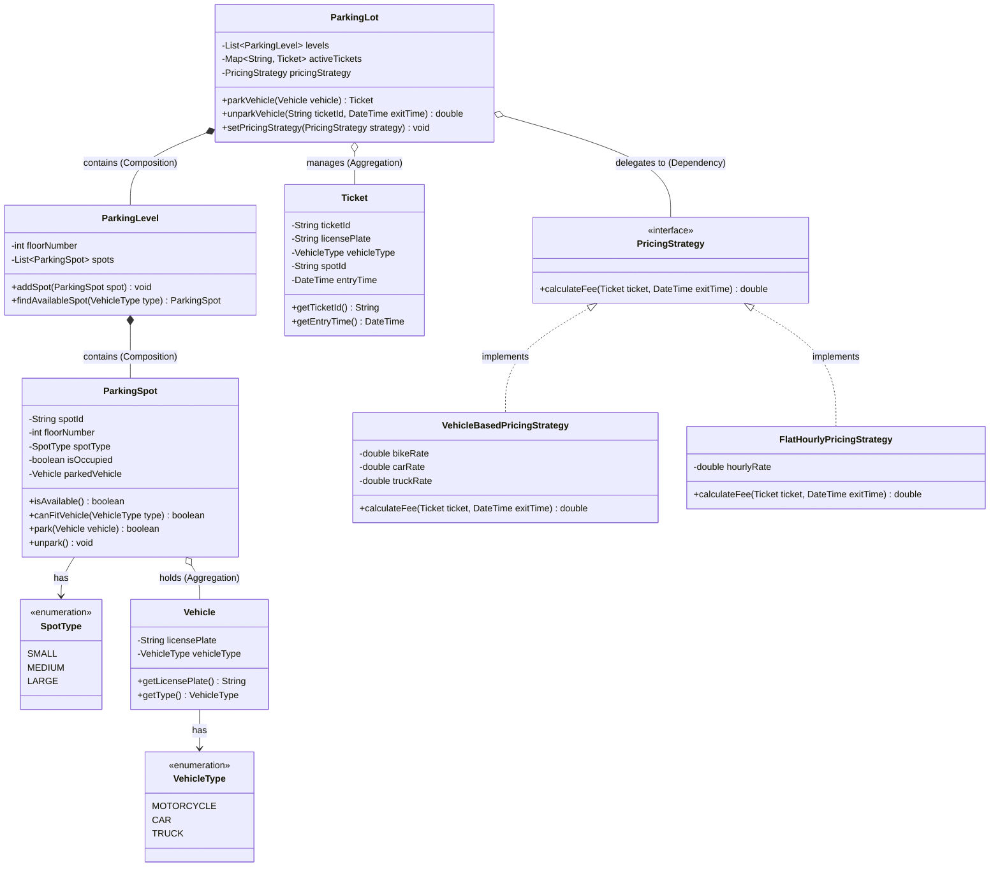

# Low-Level Design: Design a Parking Lot System

A step-by-step master guide for object-oriented design and machine coding placement interviews at top tech companies.

---

## 1. The Problem Statement

In an interview, the prompt usually starts intentionally open-ended:

> *"We want you to design a multi-level automated Parking Lot System. The system should support different vehicle types, assign spots automatically, issue tickets on entry, and calculate parking fees upon exit. Walk me through your object-oriented design and implement the core classes."*

The interviewer is testing whether you jump straight into writing code, or whether you take control of the conversation, clarify ambiguity, define clean entity boundaries, and write extensible, maintainable code.

---

## 2. Step 1 — Clarifying Requirements

Never start writing classes immediately. Spend the first 5–10 minutes asking targeted questions to lock down the exact functional scope.

### Clarifying Questions to Ask the Interviewer:

1. **What vehicle types must we support?**
   - *Interviewer response:* Motorcycles, Cars (Sedan/SUV), and large Trucks/Buses.
2. **What is the layout of the parking lot?**
   - *Interviewer response:* A multi-level parking lot. Each level has a fixed number of designated spots for small, medium, and large vehicles.
3. **How are spots assigned?**
   - *Interviewer response:* Automatically assign the first available compatible spot on the lowest available floor (e.g., nearest to the entrance).
4. **Can a smaller vehicle park in a larger spot?**
   - *Interviewer response:* For simplicity, enforce 1-to-1 matching: Motorcycle $\rightarrow$ Small Spot, Car $\rightarrow$ Medium Spot, Truck $\rightarrow$ Large Spot.
5. **How does pricing work?**
   - *Interviewer response:* Hourly pricing based on vehicle type (e.g., \$10/hr for bikes, \$20/hr for cars, \$50/hr for trucks). Pricing rules may change in the future.
6. **Do we need persistent database storage or multithreading?**
   - *Interviewer response:* Model in-memory data structures with thread-safe operations where critical.

### Locked-in Assumptions for Our Design:
- Multi-floor parking lot with distinct spot types (`SMALL`, `MEDIUM`, `LARGE`).
- Automated spot allocation using a Strategy pattern.
- Ticket issued at entry containing `ticket_id`, `vehicle_id`, `spot_id`, and `entry_time`.
- Fee computed on exit based on elapsed hours and vehicle type via a Strategy pattern.

---

## 3. Step 2 — Identifying Core Entities

To identify classes, read through your clarified requirements and extract the **nouns** representing real-world things and transactional records:

1. **`Vehicle` (Domain Entity):**
   - *Why it exists:* Represents the physical vehicle entering the lot. Holds immutable properties: license plate string and `VehicleType` enum (`MOTORCYCLE`, `CAR`, `TRUCK`).
2. **`ParkingSpot` (Stateful Entity):**
   - *Why it exists:* Represents a single physical slot. Tracks slot ID, floor level, `SpotType` enum, occupancy boolean, and a reference to the currently parked vehicle.
3. **`ParkingLevel` (Structural Container):**
   - *Why it exists:* Represents a single floor containing a collection of spots. Encapsulates finding an available spot on that specific level.
4. **`Ticket` (Session Entity):**
   - *Why it exists:* An immutable receipt issued upon entry. It binds the vehicle, the assigned spot ID, and the exact entry timestamp together.
5. **`ParkingLot` (Central Orchestrator / Facade):**
   - *Why it exists:* The entry point coordinating multi-floor operations, active ticket registries, entry/exit gates, and pricing strategies.
6. **`PricingStrategy` (Behavioral Contract):**
   - *Why it exists:* Decouples fee calculation logic from the parking lot orchestrator.

---

## 4. Step 3 — Defining Relationships

Choosing the correct relationship (Inheritance vs. Composition vs. Aggregation) is where interviewers evaluate your OOP foundations.

```
+-----------------------------------------------------------------------------+
|                         OOP RELATIONSHIPS EXPLAINED                         |
+-------------------+--------------------+------------------------------------+
| RELATIONSHIP TYPE | CODE EXAMPLE       | DESIGN RATIONALE                   |
+-------------------+--------------------+------------------------------------+
| Composition       | ParkingLot -> Level| Strong lifecycle ownership. If the |
| (Part-of, Strong) | Level -> Spot      | lot is destroyed, levels vanish.   |
+-------------------+--------------------+------------------------------------+
| Aggregation       | Spot -> Vehicle    | Weak lifecycle association. When a |
| (Has-a, Weak)     |                    | spot is freed, the vehicle exists. |
+-------------------+--------------------+------------------------------------+
| Inheritance       | Vehicle -> Car     | 'Is-a' specialization for vehicle  |
| (Is-a)            | Spot -> SmallSpot  | behavior (or clean enum dispatch). |
+-------------------+--------------------+------------------------------------+
| Dependency        | ParkingLot ->      | Loose coupling via interface       |
| (Uses-a)          | PricingStrategy    | dependency injection.              |
+-------------------+--------------------+------------------------------------+
```

### Why Composition for `ParkingLot` $\rightarrow$ `ParkingLevel` $\rightarrow$ `ParkingSpot`:
A parking spot cannot exist in isolation floating in the void without a level and a lot. If a parking lot instance is torn down, all its internal levels and spots cease to exist. This is strict **Composition**.

### Why Aggregation for `ParkingSpot` $\rightarrow$ `Vehicle`:
A parking spot holds a reference to a vehicle while it is parked. When the vehicle unparks, the spot simply sets its reference to `null`. The vehicle object continues to exist outside the lot. This is **Aggregation**.

---

## 5. Step 4 — Applying Design Patterns

Avoid forcing design patterns for the sake of buzzwords. Each pattern must solve a concrete problem:

### 1. Strategy Pattern (For Fee Calculation)
- **The Problem:** Business rules for pricing change constantly (flat rates, hourly rates, vehicle-dependent rates, peak surge rates, weekend discounts).
- **The Solution:** Define a `PricingStrategy` interface with method `calculate_fee(ticket, exit_time)`. `ParkingLot` delegates billing to whatever strategy is injected. Adding a new pricing rule requires **zero modifications** to existing lot logic (adheres to Open/Closed Principle).

### 2. Strategy Pattern (For Spot Allocation)
- **The Problem:** One client may want "First available spot", another may want "Nearest to elevator", and another may want "Even distribution across all floors".
- **The Solution:** Encapsulate allocation algorithms behind a `ParkingAssignmentStrategy` interface.

### 3. Factory Pattern (For Spot Creation)
- **The Problem:** Initializing different parking spot types directly inside the parking lot constructor tightly couples lot setup with spot creation details.
- **The Solution:** A `SpotFactory` encapsulates spot instantiation based on `SpotType`, making future extensions (like Electric Vehicle Charging Spots) isolated to a single factory class.

### 4. Singleton Pattern (For ParkingLot Instance)
- **The Problem:** Multiple entry and exit gates must interact with the exact same shared state (available spots, active tickets) to prevent race conditions and double allocation.
- **The Solution:** Implement `ParkingLot` as a thread-safe Singleton (or Facade).

---

## 6. Step 5 — Class Diagram

Below is the complete UML Class Diagram visualizing our system architecture:



---

## 7. Step 6 — Core Logic Implementation

Here is the clean, interview-focused implementation in **Python 3**. It focuses on the core orchestration methods without unnecessary boilerplate:

```python
from datetime import datetime, timedelta
from enum import Enum
from typing import Dict, List, Optional
import math


# ==========================================
# 1. ENUMS & DOMAIN ENTITIES
# ==========================================

class VehicleType(Enum):
    MOTORCYCLE = 1
    CAR = 2
    TRUCK = 3


class SpotType(Enum):
    SMALL = 1   # For Motorcycles
    MEDIUM = 2  # For Cars
    LARGE = 3   # For Trucks


class Vehicle:
    def __init__(self, license_plate: str, vehicle_type: VehicleType):
        self.license_plate = license_plate
        self.vehicle_type = vehicle_type


class ParkingSpot:
    def __init__(self, spot_id: str, floor_number: int, spot_type: SpotType):
        self.spot_id = spot_id
        self.floor_number = floor_number
        self.spot_type = spot_type
        self.is_occupied = False
        self.parked_vehicle: Optional[Vehicle] = None

    def can_fit_vehicle(self, v_type: VehicleType) -> bool:
        if v_type == VehicleType.MOTORCYCLE:
            return self.spot_type == SpotType.SMALL
        elif v_type == VehicleType.CAR:
            return self.spot_type == SpotType.MEDIUM
        elif v_type == VehicleType.TRUCK:
            return self.spot_type == SpotType.LARGE
        return False

    def park(self, vehicle: Vehicle) -> bool:
        if self.is_occupied or not self.can_fit_vehicle(vehicle.vehicle_type):
            return False
        self.parked_vehicle = vehicle
        self.is_occupied = True
        return True

    def unpark(self) -> None:
        self.parked_vehicle = None
        self.is_occupied = False


class Ticket:
    def __init__(self, ticket_id: str, vehicle: Vehicle, spot_id: str, entry_time: datetime):
        self.ticket_id = ticket_id
        self.license_plate = vehicle.license_plate
        self.vehicle_type = vehicle.vehicle_type
        self.spot_id = spot_id
        self.entry_time = entry_time


# ==========================================
# 2. STRATEGY PATTERN (PRICING)
# ==========================================

class PricingStrategy:
    def calculate_fee(self, ticket: Ticket, exit_time: datetime) -> float:
        raise NotImplementedError


class VehicleBasedPricingStrategy(PricingStrategy):
    def __init__(self, bike_rate: float = 10.0, car_rate: float = 20.0, truck_rate: float = 50.0):
        self.rates = {
            VehicleType.MOTORCYCLE: bike_rate,
            VehicleType.CAR: car_rate,
            VehicleType.TRUCK: truck_rate
        }

    def calculate_fee(self, ticket: Ticket, exit_time: datetime) -> float:
        duration = exit_time - ticket.entry_time
        hours = math.ceil(duration.total_seconds() / 3600.0)
        if hours <= 0:
            hours = 1  # Minimum 1-hour charge
        return hours * self.rates.get(ticket.vehicle_type, 20.0)


# ==========================================
# 3. PARKING LEVEL & PARKING LOT ORCHESTRATOR
# ==========================================

class ParkingLevel:
    def __init__(self, floor_number: int):
        self.floor_number = floor_number
        self.spots: List[ParkingSpot] = []

    def add_spot(self, spot: ParkingSpot) -> None:
        self.spots.append(spot)

    def find_available_spot(self, v_type: VehicleType) -> Optional[ParkingSpot]:
        for spot in self.spots:
            if not spot.is_occupied and spot.can_fit_vehicle(v_type):
                return spot
        return None


class ParkingLot:
    def __init__(self, pricing_strategy: PricingStrategy):
        self.levels: List[ParkingLevel] = []
        self.active_tickets: Dict[str, Ticket] = {}
        self.pricing_strategy = pricing_strategy
        self._ticket_counter = 1000

    def add_level(self, level: ParkingLevel) -> None:
        self.levels.append(level)

    def set_pricing_strategy(self, strategy: PricingStrategy) -> None:
        self.pricing_strategy = strategy

    def park_vehicle(self, vehicle: Vehicle) -> Optional[Ticket]:
        # 1. Search levels sequentially for the lowest available compatible spot
        for level in self.levels:
            spot = level.find_available_spot(vehicle.vehicle_type)
            if spot and spot.park(vehicle):
                self._ticket_counter += 1
                ticket_id = f"TKT-{self._ticket_counter}"
                ticket = Ticket(ticket_id, vehicle, spot.spot_id, datetime.now())
                self.active_tickets[ticket_id] = ticket
                print(f"[ENTRY SUCCESS] {vehicle.license_plate} parked at Spot {spot.spot_id} -> Ticket: {ticket_id}")
                return ticket

        print(f"[ENTRY FAILED] No available spot for vehicle: {vehicle.license_plate}")
        return None

    def unpark_vehicle(self, ticket_id: str, exit_time: datetime) -> float:
        if ticket_id not in self.active_tickets:
            print(f"[EXIT ERROR] Invalid ticket ID: {ticket_id}")
            return -1.0

        ticket = self.active_tickets.pop(ticket_id)

        # 2. Find and free the allocated parking spot
        for level in self.levels:
            for spot in level.spots:
                if spot.spot_id == ticket.spot_id:
                    spot.unpark()
                    break

        # 3. Calculate fee via strategy
        fee = self.pricing_strategy.calculate_fee(ticket, exit_time)
        print(f"[EXIT SUCCESS] Ticket: {ticket_id} freed Spot {ticket.spot_id} | Total Fee: ${fee:.2f}")
        return fee


# ==========================================
# 4. RUNNABLE DEMO & TEST
# ==========================================

if __name__ == "__main__":
    # Initialize system with Strategy pattern
    pricing = VehicleBasedPricingStrategy(bike_rate=10.0, car_rate=20.0, truck_rate=50.0)
    lot = ParkingLot(pricing)

    # Setup 2 floors
    floor1 = ParkingLevel(1)
    floor1.add_spot(ParkingSpot("F1-S1", 1, SpotType.SMALL))
    floor1.add_spot(ParkingSpot("F1-C1", 1, SpotType.MEDIUM))
    lot.add_level(floor1)

    floor2 = ParkingLevel(2)
    floor2.add_spot(ParkingSpot("F2-C1", 2, SpotType.MEDIUM))
    lot.add_level(floor2)

    # Test 1: Park vehicles
    car1 = Vehicle("KA-01-AB-1234", VehicleType.CAR)
    car2 = Vehicle("MH-02-CD-5678", VehicleType.CAR)
    car3 = Vehicle("DL-03-EF-9999", VehicleType.CAR)

    t1 = lot.park_vehicle(car1)  # Assigned F1-C1
    t2 = lot.park_vehicle(car2)  # Assigned F2-C1
    t3 = lot.park_vehicle(car3)  # Fails: Lot Full for Cars

    # Test 2: Unpark car1 after 3 hours
    exit_time = datetime.now() + timedelta(hours=3)
    if t1:
        lot.unpark_vehicle(t1.ticket_id, exit_time)

    # Test 3: Retrying car3 now succeeds
    t3_retry = lot.park_vehicle(car3)  # Assigned freed F1-C1
```

---

## 8. Step 7 — Handling Extensions (How Our Patterns Pay Off)

During an interview, once your base code runs, the interviewer will challenge your design with extensions. Here is how our architecture easily accommodates them:

### Extension A: "What if we add Electric Vehicle (EV) Charging spots?"
- **How we adapt:**
  1. Add `ELECTRIC` to `SpotType` and `VehicleType` (or create an `ElectricCar` class).
  2. Subclass `ParkingSpot` $\rightarrow$ `ElectricParkingSpot` with attributes `kwh_consumed` and `is_charging`.
  3. Create an `EVPricingStrategy` that computes `(hours * hourly_rate) + (kwh * electricity_rate)`.
  4. **Zero changes** needed to `ParkingLot` core logic.

### Extension B: "What if we introduce Dynamic Weekend & Surge Pricing?"
- **How we adapt:**
  1. Create a `WeekendSurgePricingStrategy` implementing `PricingStrategy`.
  2. At runtime, call `parking_lot.set_pricing_strategy(WeekendSurgePricingStrategy(multiplier=1.5))`.
  3. The system swaps billing rules on the fly without stopping service.

---

## 9. Common Interview Follow-Ups

1. **Concurrency and Race Conditions:**
   - *What is tested:* What happens when two cars arrive at Entry Gate 1 and Entry Gate 2 simultaneously and both try to book the last remaining spot?
   - *How to answer:* Explain thread synchronization: protect the `find_available_spot()` and `park()` critical section using locks/mutexes per level, or use thread-safe concurrent queues.
2. **Nearest-to-Entrance Spot Allocation Strategy:**
   - *What is tested:* Data structure proficiency.
   - *How to answer:* Use a **Min-Heap (Priority Queue)** for each spot type ordered by distance/floor instead of linearly scanning arrays in $O(N)$ time. Finding a spot becomes $O(\log N)$.
3. **Multi-Gate Support:**
   - *What is tested:* Facade and Gate modeling.
   - *How to answer:* Model `EntryGate` and `ExitGate` classes that hold a reference to the `ParkingLot` Singleton to issue and validate tickets independently.
4. **Handling Lost Tickets:**
   - *What is tested:* Edge-case handling.
   - *How to answer:* Provide a `calculate_lost_ticket_fee(license_plate)` method that charges a maximum flat penalty fee.

---

## 10. Check Your Understanding

Test your mastery of this problem by answering these 3 questions:

1. **Trade-off Analysis:** Why did we choose to use a `PricingStrategy` interface instead of writing a simple `switch-case` statement inside `calculate_fee()`? Under what circumstances would a `switch-case` actually be acceptable?
2. **Data Structure Optimization:** In our implementation, finding an available spot takes $O(N)$ time where $N$ is the number of spots on a level. How would you redesign the `ParkingLevel` storage to allocate and free spots in $O(1)$ time?
3. **OOP Modeling:** If a requirement change allows a Motorcycle to park in any Large or Medium spot when Small spots are exhausted, which class and method should contain this matching rule to preserve the Single Responsibility Principle?
